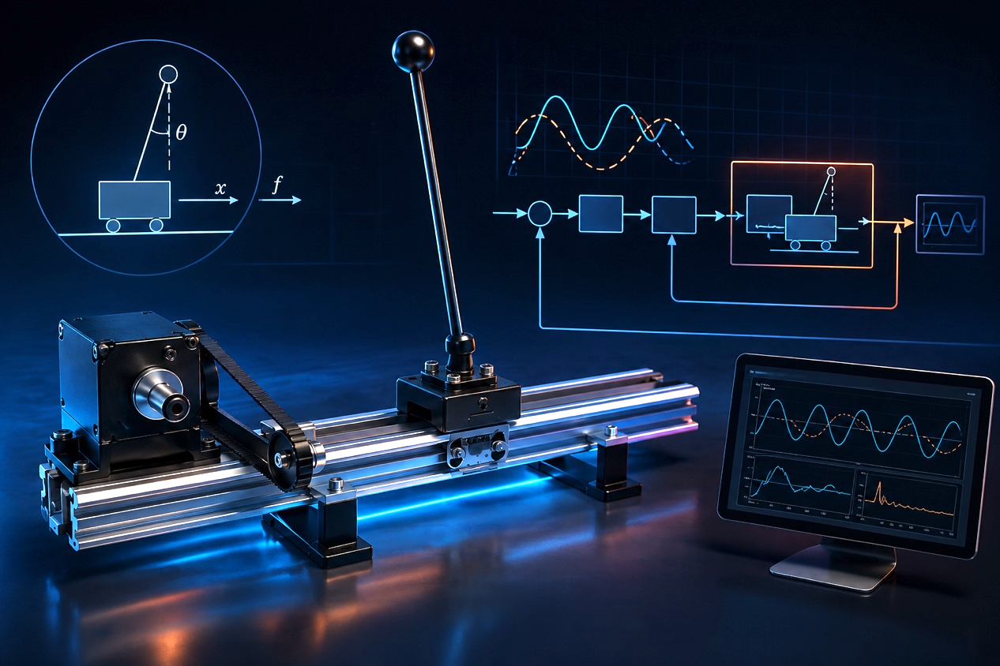
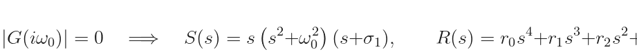
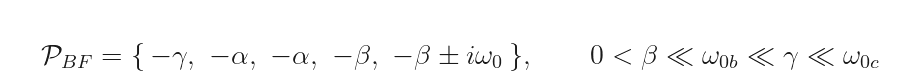
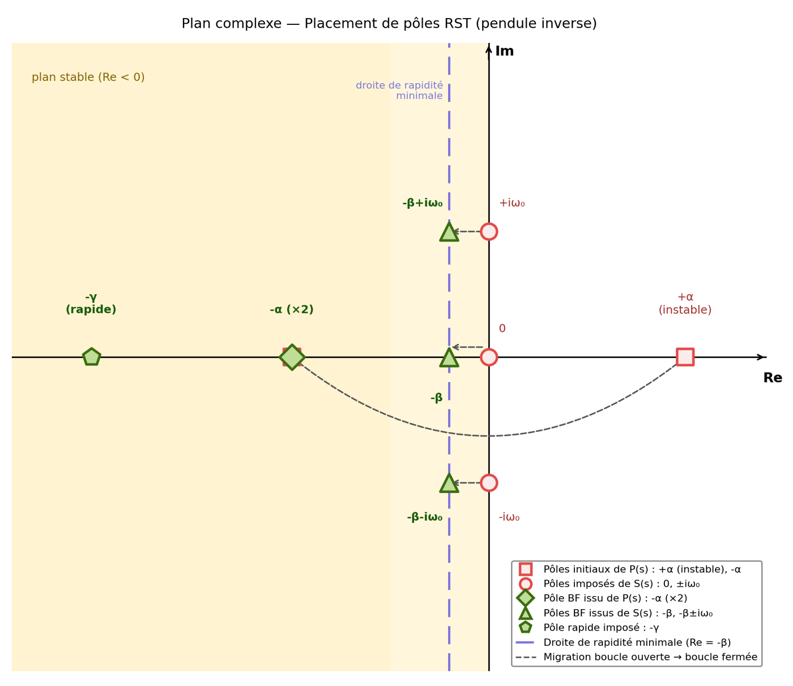
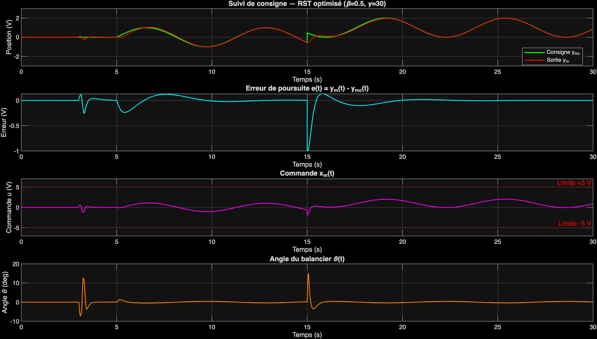
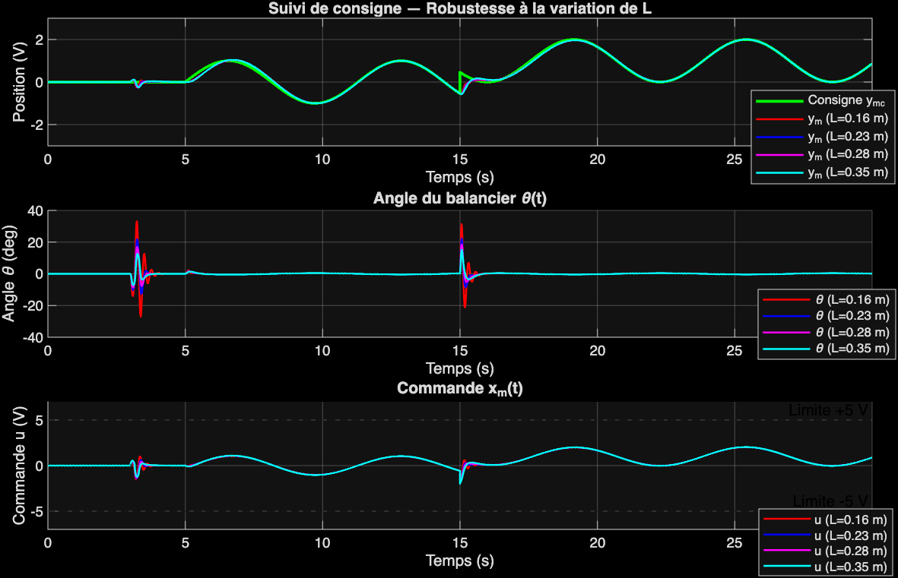

# RST Polynomial Control of an Inverted Pendulum


Making an **open-loop unstable inverted pendulum track a sinusoidal reference with zero steady-state error**, reject step disturbances, and never exceed ±5 V of actuator command — with a two-degree-of-freedom **RST polynomial controller** synthesized by pole placement through the **Bézout equation**.

<p align="center">
  
  <br><em>The problem in one picture: balance the pendulum upright while the cart follows a sine wave — and do it politely (|u| ≤ 5 V).</em>
</p>

## The problem, from first principles

Everything starts with the **Lagrange equations** of the cart-pendulum system — two coupled nonlinear ODEs:

<p align="center">
  <picture>
    <source media="(prefers-color-scheme: dark)" srcset="docs/equations/eq1_lagrange_dark.png">
    
  </picture>
</p>

Linearizing around the upright equilibrium (θ = 0):

<p align="center">
  <picture>
    <source media="(prefers-color-scheme: dark)" srcset="docs/equations/eq2_linearized_dark.png">
    
  </picture>
</p>

A key structural insight makes the synthesis tractable: the **cart-position servo is fast** (ω₀c ≈ 51.7 rad/s, identified experimentally from a closed-loop step test) while the **pendulum is slow** (ω₀b = √(g/l) ≈ 5–8 rad/s). This **time-scale separation** lets the inner cart loop be approximated by its static gain, leaving a clean second-order design plant with **one unstable pole at +α**:

<p align="center">
  <picture>
    <source media="(prefers-color-scheme: dark)" srcset="docs/equations/eq3_reduced_dark.png">
    
  </picture>
</p>

That single right-half-plane pole is the whole difficulty: the system falls over on its own, classical Bode margins stop being trustworthy, and any controller has to *actively* relocate that pole — not just shape a stable loop.

## Why RST is exactly the right tool here

The specification stacks **three requirements that pull in different directions**: perfect tracking of a *sinusoid* (not a step!), rejection of *step* disturbances, and a hard actuator ceiling. The RST structure answers each one by construction:

1. **Internal model principle.** Zero steady-state error at a frequency requires the loop to have infinite gain there. So the sinusoid's model `(s² + ω₀²)` and an integrator `s` are *embedded directly inside* `S(s)` — tracking accuracy becomes a structural property of the controller, not a tuning accident:

<p align="center">
  <picture>
    <source media="(prefers-color-scheme: dark)" srcset="docs/equations/eq4_internal_model_dark.png">
    
  </picture>
</p>

2. **Two degrees of freedom.** `R/S` shapes feedback (stability, disturbance rejection) while `T` independently shapes reference tracking — so the tracking and rejection requirements are decoupled instead of fighting each other, something no single-loop PID can offer.

3. **Explicit pole assignment for an unstable plant.** The closed-loop characteristic polynomial is *chosen*, and the controller coefficients follow exactly from the **Bézout equation**:

<p align="center">
  <picture>
    <source media="(prefers-color-scheme: dark)" srcset="docs/equations/eq5_bezout_dark.png">
    
  </picture>
</p>

The desired pole set reassigns the unstable pole +α to −α, places the tracking dynamics at −β ± iω₀, and adds a fast pole −γ — all ordered by the time-scale separation rule:

<p align="center">
  <picture>
    <source media="(prefers-color-scheme: dark)" srcset="docs/equations/eq6_poles_dark.png">
    
  </picture>
</p>

<p align="center">
  
  <br><em>The whole strategy in the complex plane: the unstable open-loop pole (red square, +α) is mirrored into the stable half-plane; the imposed poles of S(s) (0, ±iω₀) migrate onto the minimum-speed line at −β; a fast pole −γ absorbs the leftover design freedom.</em>
</p>

## From initial design to optimized design

The first parameter set (β = 1, γ = 10) works but leaves the Nyquist locus uncomfortably close to the critical point (modulus margin ≈ 0.49, phase margin 30°). Retuning to **β = 0.5, γ = 30** trades a slightly slower rejection for substantially more robustness:

| | Initial (β=1, γ=10) | **Optimized (β=0.5, γ=30)** |
|---|---|---|
| Phase margin | 30° | **42.8°** |
| Disturbance rejection time | 1.35 s | **1.55 s** |
| Peak command | < 5 V | **2.03 V** (59% headroom) |
| Peak pendulum angle | 17.56° | **15.05°** |

<p align="center">
  
  <br><em>Optimized closed loop: near-perfect sinusoidal tracking, a step disturbance at t = 15 s rejected in ≈ 1.55 s, command comfortably inside ±5 V, pendulum excursion ≤ 15°.</em>
</p>

Because the plant is open-loop unstable, classical margins alone aren't conclusive — stability is confirmed through the **generalized Nyquist criterion** (one counter-clockwise encirclement of −1 for the one RHP pole) and the roots of the assigned polynomial, all in the left half-plane.

## Parametric robustness: one controller, four pendulums

The optimized controller is then **frozen** and the pendulum length swept over `L ∈ {0.16, 0.23, 0.28, 0.35} m` — which moves the unstable pole α = √(g/L) from 5.29 to 7.83 rad/s:

| L (m) | α (rad/s) | Phase margin | Peak command |
|---|---|---|---|
| 0.16 | 7.83 | 48.5° | 2.01 V |
| 0.23 | 6.53 | 48.0° | 2.02 V |
| 0.28 | 5.92 | 46.2° | 2.03 V |
| 0.35 | 5.29 | 42.8° | 2.03 V |

<p align="center">
  
  <br><em>The four responses are nearly indistinguishable, and disturbance rejection stays at ≈ 1.56 s for every length — because the dominant closed-loop poles are fixed by the controller, not by the plant. That's pole placement doing exactly what it promises.</em>
</p>

The one physical limit shows up in the pendulum angle: at L = 0.16 m the transient peaks at 31.3°, brushing the boundary of the small-angle linearization — a fair reminder that parametric robustness of the *linear* design is not a nonlinear global-stability guarantee.

## Repository layout

```
matlab/
├── rst_pendulum_synthesis.m    Full synthesis: A_BF, Bézout → R,S,T; Bode/Nyquist + margins;
│                                 Simulink run; robustness sweep over L
└── rst_closed_loop.mdl         Simulink closed-loop model (tracking + disturbance injection)

python/
└── pole_placement_plot.py      Complex-plane pole-placement figure (matplotlib)

docs/
├── RST_Inverted_Pendulum_Report.pdf   Full 37-page report (modeling, synthesis, evaluation,
│                                        optimization, robustness study)
├── images/                            Figures used in this README
└── equations/                         Pre-rendered equations (light/dark variants)
```

## How to run

```matlab
cd matlab
rst_pendulum_synthesis      % synthesis + margins + Simulink simulation + robustness sweep
```

```bash
pip install matplotlib numpy
python python/pole_placement_plot.py
```

Requires MATLAB + Control System Toolbox + Simulink; Python 3.10+ for the pole plot.

> Note: display equations in this README are pre-rendered PNGs (light/dark variants) so they display correctly everywhere, including the GitHub mobile app, which does not render `$$` LaTeX.

## Author & context

**Dev Kumar** — Arts et Métiers ParisTech (ENSAM), Robust Control / Mechatronics, Semester 10 — 2026. Supervisor: **Hervé Guillard**.

Full derivations, frequency-domain analysis, and the complete robustness protocol: [`docs/RST_Inverted_Pendulum_Report.pdf`](docs/RST_Inverted_Pendulum_Report.pdf).

**Related projects** — the same pole-placement / state-space design toolbox applied elsewhere: [twin-rotor helicopter (integral state feedback + LQR)](https://github.com/devkumar-projects/Control-of-an-instable-system-using-digital-state-feedback) · [INTARSO target robot (PID as state feedback on hardware)](https://github.com/devkumar-projects/INTARSO-Shooting-Range-Target-Robot).

## References

- Åström, K.J. & Wittenmark, B. — *Computer-Controlled Systems: Theory and Design*
- Landau, I.D. & Zito, G. — *Digital Control Systems*

## License

MIT — see [LICENSE](LICENSE).
